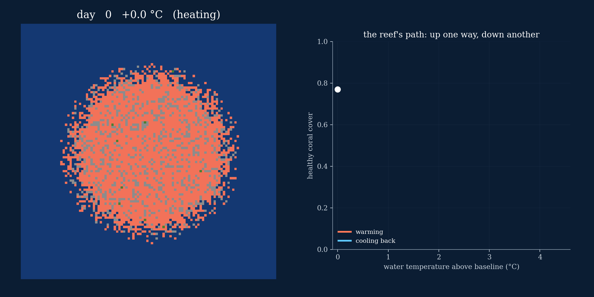
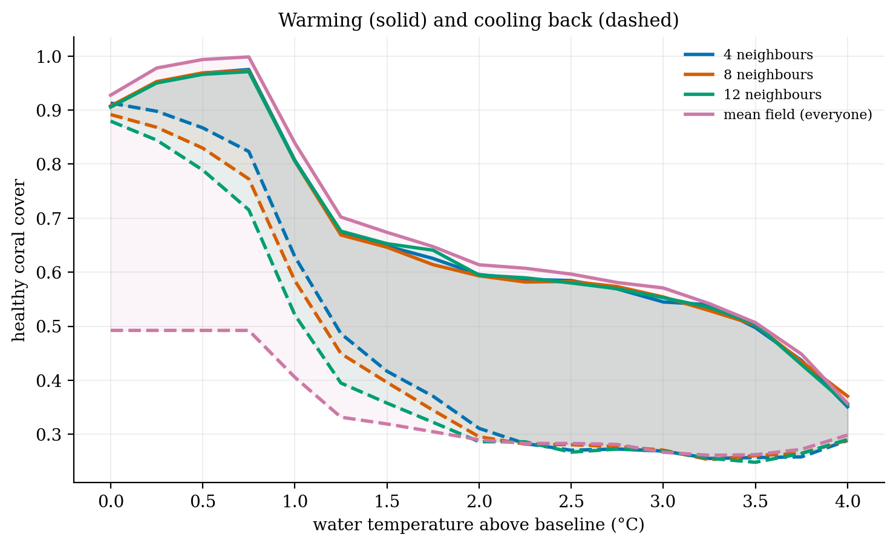
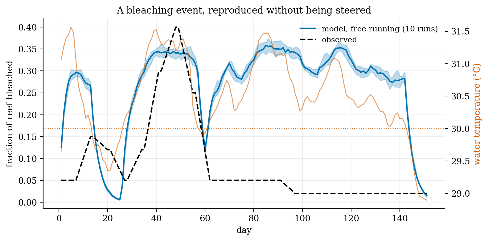
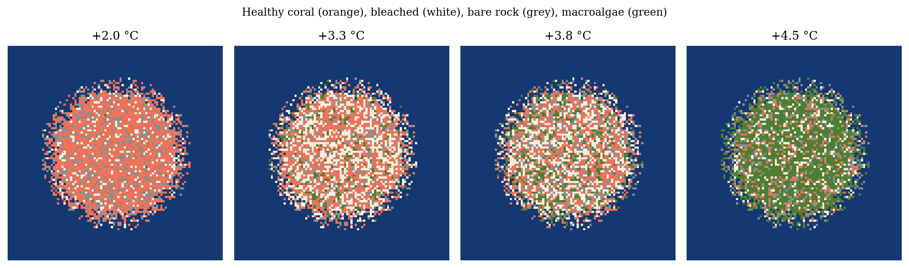
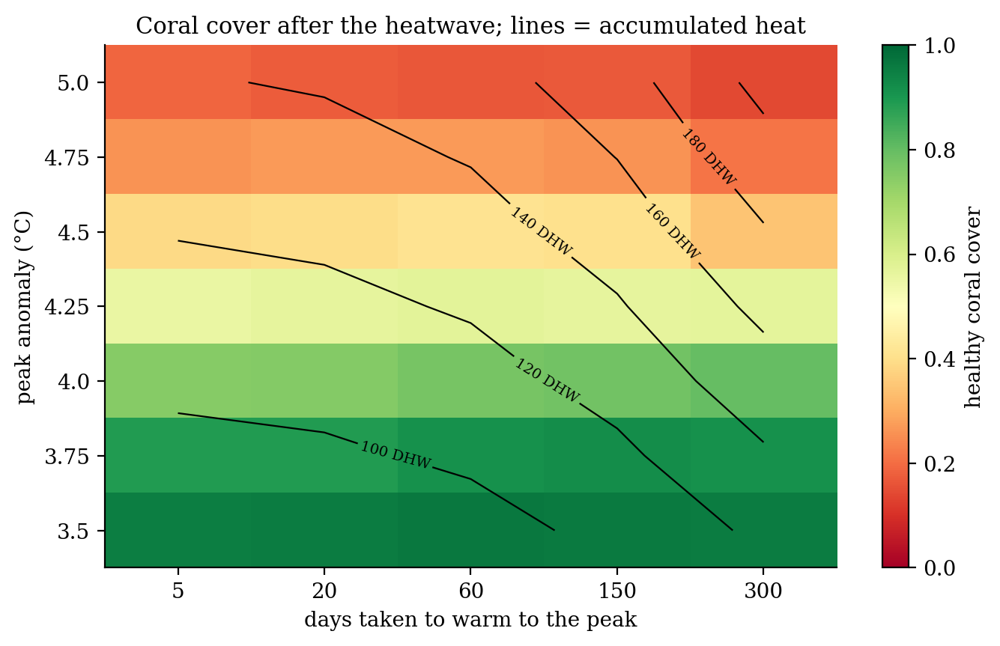
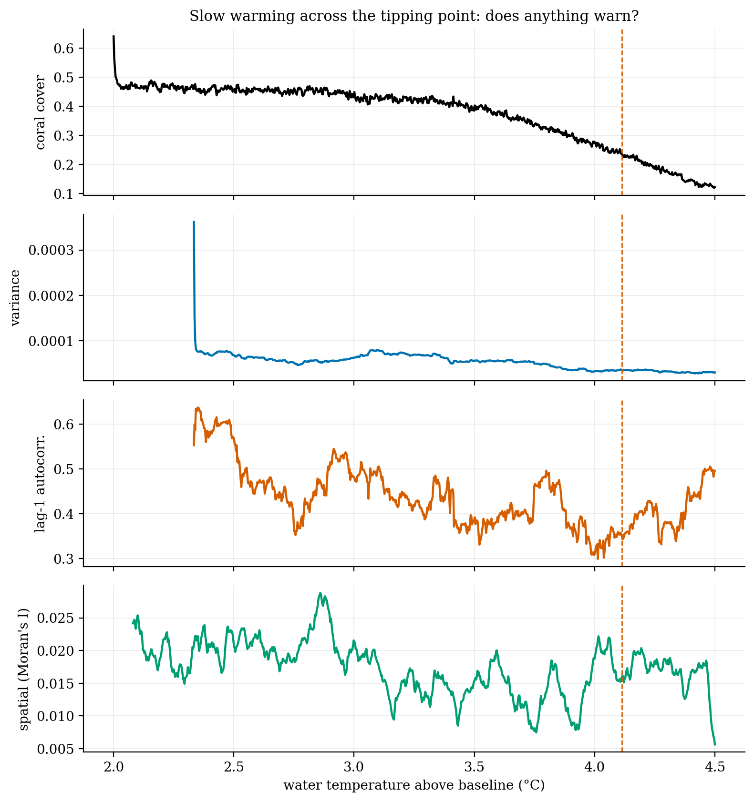

# When a reef can't come back

**A coral reef modelled like a magnet shows why the classic reef models make collapse look more sudden and more permanent than it is.**

A reef is a patchwork. Each patch is healthy coral, bleached coral, bare rock or seaweed, and each is pushed around by the water temperature and by its neighbours, the way spins in a magnet are. Physicists have a firm rule about systems like this: models in which every patch feels every other ("mean field") exaggerate how abrupt and how irreversible a change is. The best-known reef models are mean-field.

So I built the reef on a lattice, switched the reach of the interactions from four neighbours to the whole reef, and warmed and cooled the water.

- **It reproduces a real bleaching event** without being steered towards it: 37% of the reef bleached in the model, against 40% observed, and it recovered.
- **Reefs get stuck.** Once heat kills enough coral, seaweed takes the space, and cooling the water back doesn't bring the coral back.
- **Mean field gets stuck worst.** The loop is about 60% wider when every patch feels the whole reef than with four neighbours: local survivors reseed their surroundings.
- **Two honest negatives.** Warming *speed* barely matters; how hot it gets does. And none of the classic early-warning signals fire before collapse, because the slide is gradual.

| | |
|:-:|:-:|
|  |  |
|  |  |

**Built:** a vectorised rewrite of my original Potts model, about 9× faster. Along the way I found that coral in the original could never die: its death rule needed heat stress above a cap. Adding mortality and grazed macroalgae (the Mumby feedback) fixed that.

`coral_model.py` · `coral_potts.ipynb` · Python, NumPy, SciPy

*A side project, built for fun. The model is a toy reef calibrated to one bleaching record, so the results are qualitative. The Scott Reef temperature record it is calibrated on (`Coral temps.xlsx`) comes from reef-monitoring data and isn't redistributed here.*
