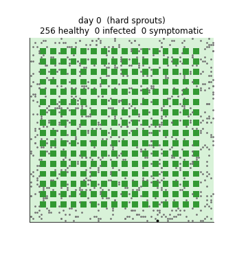
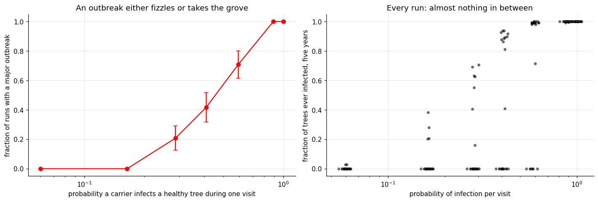
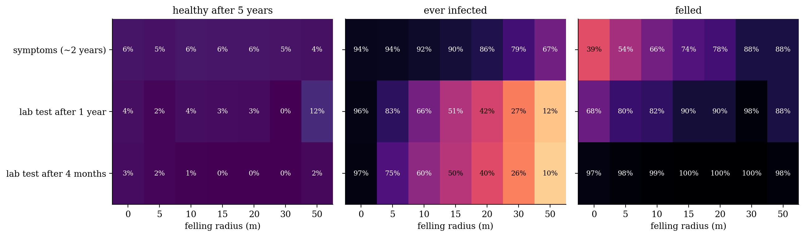
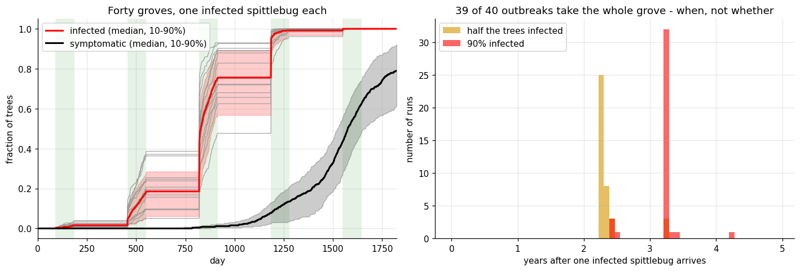
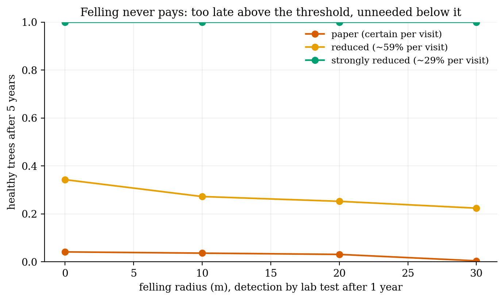

# The bug that kills olive trees, one spittlebug at a time

**Simulating *Xylella fastidiosa* in an olive grove shows the outbreak sitting on a knife-edge, and felling trees failing to push it off.**

*Xylella* has killed millions of olive trees in southern Italy. It's carried by meadow spittlebugs, and symptoms take about two years to show. I rebuilt a published lattice model of the grove (Fierro et al., 2019), where every spittlebug walks, feeds and passes the bacterium on, then made it about 95× faster and asked what actually stops it.

- **Outbreaks are all-or-nothing.** 39 of 40 take the whole grove, with half the trees infected in about 2.3 years. One never starts.
- **A one-day slip moved a two-year answer by 38%.** The original code put the grove in the wrong season on day 0, which gave every outbreak a head start.
- **There's a sharp threshold.** A spittlebug stays on a tree for about 18 days per visit. Below about 16–29% chance of infection per visit, outbreaks die out; above it, they take the grove.
- **Felling never paid.** No felling radius or detection speed left more trees standing: too late above the threshold, unnecessary below it. Reducing spittlebug contact did the work.

| | |
|:-:|:-:|
|  |  |
|  |  |

**Built:** a vectorised rewrite (`olive_model.py`), checked against my original model across 12 + 200 runs; four bug fixes; a transmission log; felling and detection policies; and parallel ensembles.

`olive_grove_01_model.ipynb` · `olive_grove_02_felling.ipynb` · Python, NumPy, multiprocessing

*A side project, built for fun. These are model results, not policy advice.*
