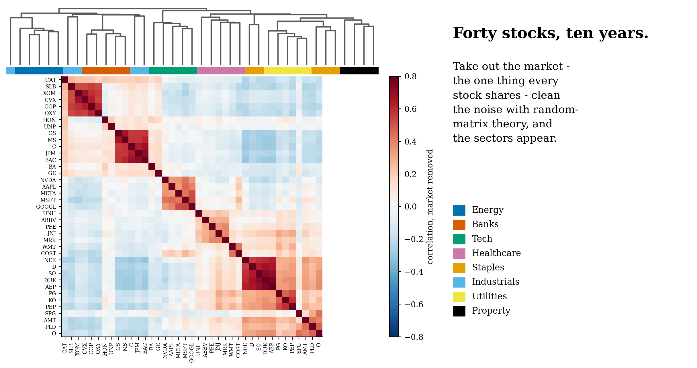
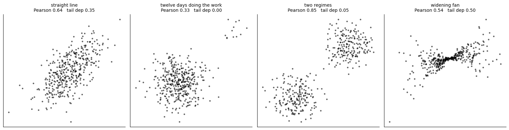
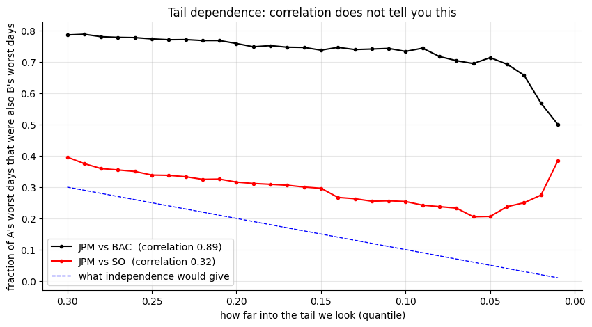
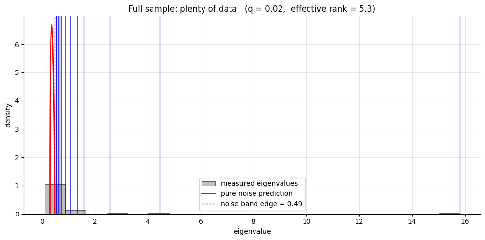
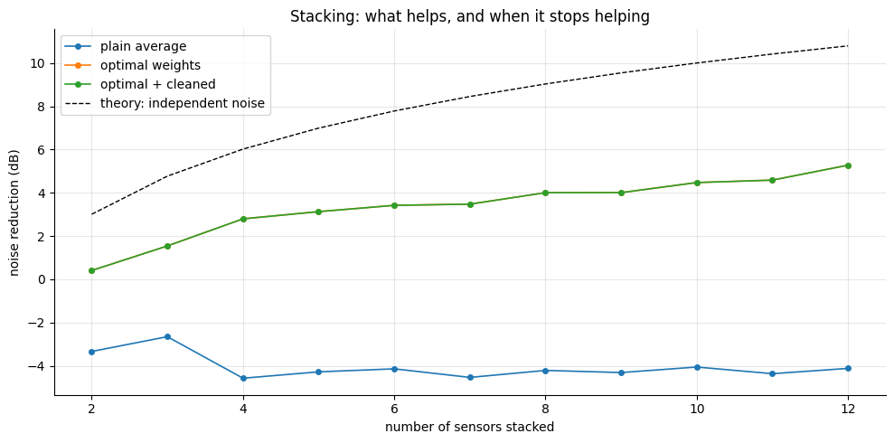
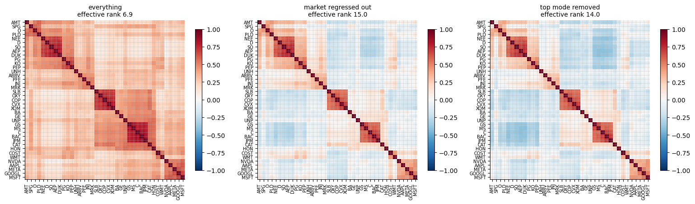
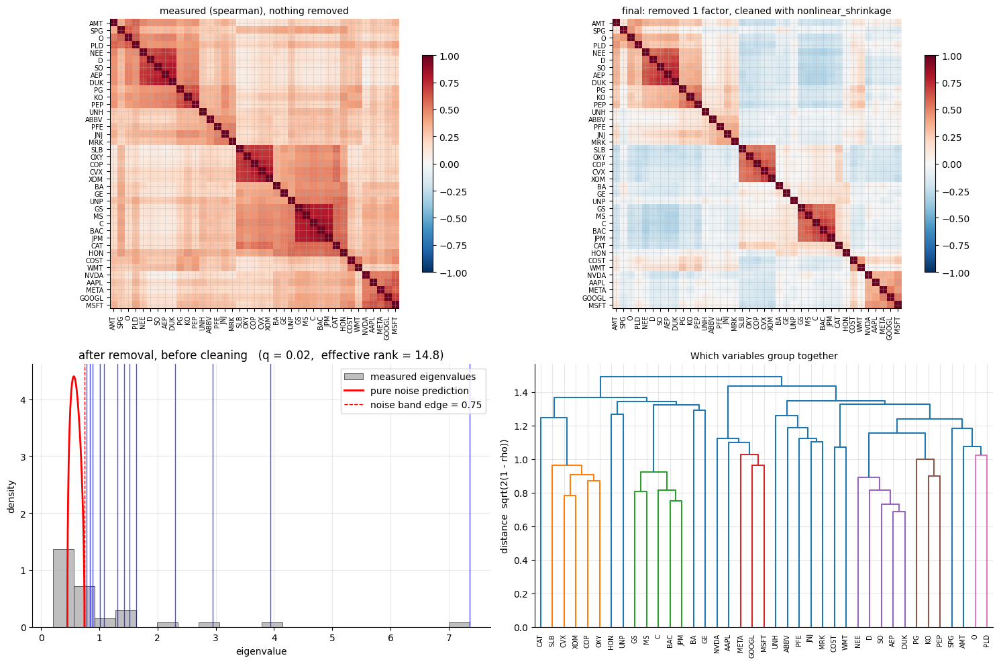

# corrlib: how much of a correlation is real?

**A small Python library for measuring, cleaning and stripping down correlation matrices, used by the seismic and solar projects.**



With 40 stocks there are 780 correlations to estimate, and most of what a year of data says about them is noise. Random-matrix theory says exactly what pure noise looks like, so you can clean against it. Strip out the market, the one thing every stock shares, and the sectors appear.

```python
from corrlib import Correlator
c = Correlator(measure="gaussian_rank", remove=[market], clean="nonlinear_shrinkage", effective_n="bartlett")
C = c.fit(returns)
c.plot()
```

- **Taking out the market** raises the effective number of independent bets from about 7 to 15.
- **The cleaners are tested against known answers** (59 tests). Ledoit–Wolf matches scikit-learn exactly. Nonlinear shrinkage, using Ledoit & Wolf's 2020 estimator, is the best cleaner on structured data. The first version I wrote was worse than no cleaning at all near q = 1, and the tests caught it.
- **An honest portfolio test.** Cleaning closes only part of the gap between the risk a portfolio claims and the risk it delivers. An earlier "perfect" result turned out to be a units bug.

| | |
|:-:|:-:|
|  |  |
|  |  |
|  |  |

**Built:** correlation measures (Pearson, rank, Gaussian rank, partial, distance, tail dependence, lead–lag); estimators for irregular data; factor and mode removal; random-matrix cleaning; array stacking (minimum-variance = Capon beamformer); clustered heatmaps; effective sample size.

`corrlib/` · `corrlib_showcase.ipynb` · `tests/` · Python, NumPy, SciPy

*A side project, built for fun, and the shared engine of projects 004 and 007. Prices come from Yahoo Finance via yfinance; the notebook downloads them, and they aren't stored in the repository.*
