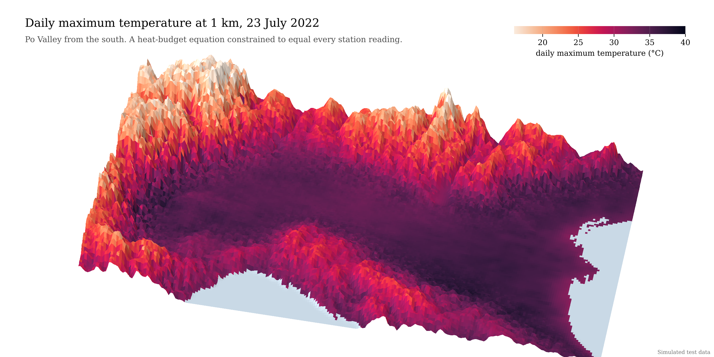
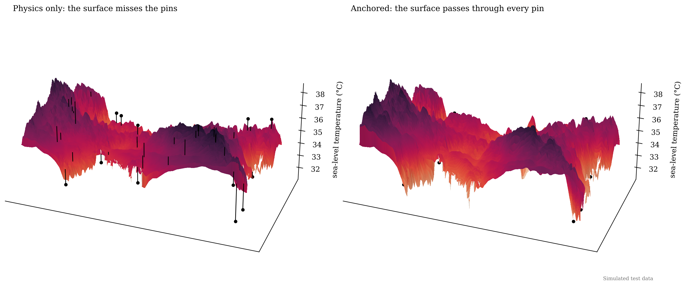
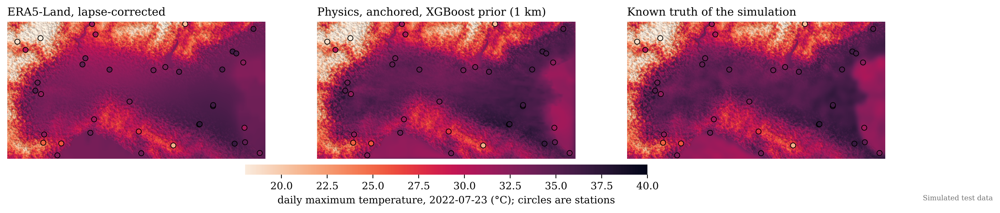
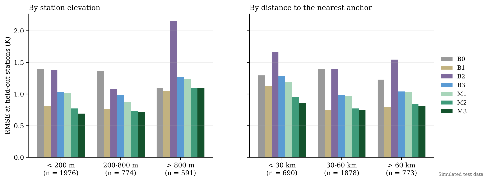
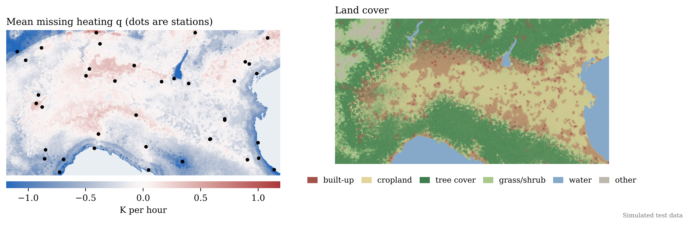
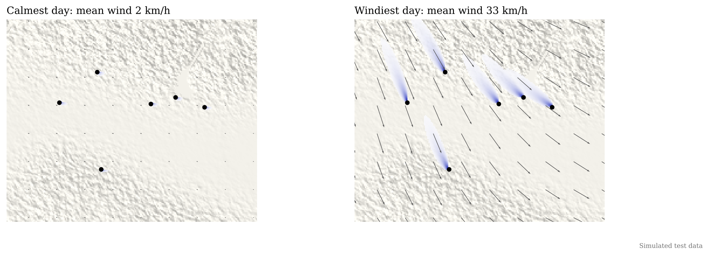
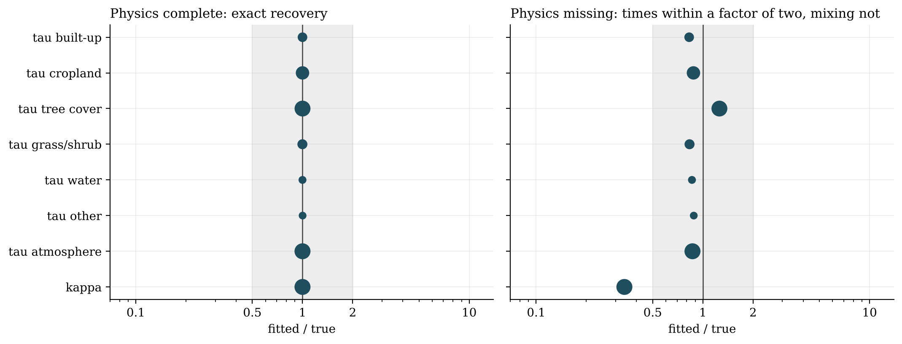

# What is the temperature between the weather stations?

**A heat-budget equation, forced to equal every station reading, with machine learning supplying the physics it lacks. Daily maximum temperature at 1 km over the Po Valley.**



ERA5-Land describes the Po Valley in boxes about 9 km across. Gridded station products such as E-OBS fill the map by interpolating stations, and stop returning the stations in the process. This project builds daily maximum temperature on a 1 km grid for June to August 2021-2023 under two constraints: between stations the surface obeys a reduced heat-budget equation in which each land-cover class couples the air to the ground at its own rate, and at stations it equals the observation exactly. XGBoost learns the heating the equation leaves out and returns it to the equation as a prior.

**Data.** Station locations, coastline, lakes and city outlines are real; elevation and land cover are estimated from them. The daily fields (ERA5-Land, MODIS, E-OBS, station readings) are simulated in the shape of the real products, with a known truth behind them. The numbers below therefore test the method and are not findings about the Po Valley. `download_data.py` fetches the real products; that run is next.

- **The constraint holds.** On all 276 days the surface returns every station to within 10⁻¹² K. Before any data, the solver recovered planted parameters exactly when its physics was complete, and to within 25% (relaxation times) when it was not.
- **Anchored physics matches regression-kriging; it does not clearly beat it.** At stations in held-out 50 km blocks in 2023, RMSE falls from 1.34 K (ERA5-Land) to 1.03 K (physics only), 0.83 K (anchored) and 0.79 K (with the XGBoost prior). Regression with kriged residuals scores 0.85 K, and the 0.06 K gap has a 95% interval of -0.14 to +0.00 K.
- **The physics is local; the statistics give it reach.** The fitted relaxation times are short, so a station's footprint is a plume a few kilometres long. The wind term is worth 0.045 K. The fitted mixing coefficient is forty times smaller than the scheme's own numerical diffusion and cannot be interpreted.

| | |
|:-:|:-:|
|  |  |
|  |  |
|  |  |

## The model

Temperature is reduced to sea level, θ = T + Γz with Γ = 6.5 K/km, and each day solves

```
u · ∇θ  −  κ ∇²θ  +  (θ − θ_s) / τ_s(x)  +  (θ − θ_E) / τ_a  =  q(x),      θ = θ_E on the boundary
1 / τ_s(x) = Σ_c f_c(x) / τ_c
```

θ_s is MODIS land surface temperature, θ_E is ERA5-Land Tmax, f_c are land-cover fractions and q is the heating the equation lacks. Discretised (first-order upwind, five-point Laplacian) this is a sparse system A θ = b + q. With H selecting station cells and y the readings, the anchored solution minimises (q − q̂)ᵀ W (q − q̂) subject to both A θ = b + q and H θ = y, where W = I + ℓ_q² L penalises size and roughness:

```
θ₀ = A⁻¹(b + q̂)        d = y − Hθ₀        G = HA⁻¹   (one adjoint solve per station)
q  = q̂ + W⁻¹Gᵀ (G W⁻¹ Gᵀ)⁻¹ d             θ = A⁻¹(b + q)             T = θ − Γz
```

Parameters are fitted with adjoint gradients: one extra solve per day gives the derivative with respect to all eight.

## Skill at held-out stations, 2023

| | Model | RMSE (K) | Bias (K) | < 200 m | 200-800 m | > 800 m |
|---|---|:-:|:-:|:-:|:-:|:-:|
| B0 | ERA5-Land, bilinear + lapse rate | 1.34 | -0.58 | 1.39 | 1.36 | 1.10 |
| B1 | Regression + kriged residuals | 0.85 | +0.05 | 0.81 | 0.77 | 1.05 |
| B2 | E-OBS (simulated, see note) | 1.49 | +0.55 | 1.38 | 1.08 | 2.16 |
| B3 | XGBoost on station residuals | 1.07 | +0.21 | 1.03 | 0.98 | 1.27 |
| M1 | Physics only (q = 0) | 1.03 | +0.32 | 1.02 | 0.88 | 1.23 |
| M2 | Physics, anchored | 0.83 | +0.04 | 0.77 | 0.73 | 1.09 |
| M3 | Physics, anchored, XGBoost prior | 0.79 | +0.03 | 0.69 | 0.72 | 1.10 |

3,341 station-days at 39 stations, five folds of 50 km blocks, parameters fitted on 2021-2022. The simulated E-OBS is interpolated from its own 30-station network, so B2's score reflects that choice. Against the simulation's hidden truth at every land cell the ranking is the same (1.22 K, 0.85 K, 0.63 K for B0, M1, M2) and the XGBoost prior adds nothing at map level.

## Provenance

| Dataset | Tier | Source |
|---|---|---|
| Station locations and elevations | real | Meteostat station list (CC BY 4.0), 39 stations with an observed 2021-2023 record |
| Elevation (1 km) | estimated | 5 arc-minute Mapzen/SRTM grid (via pvlib), interpolated, plus generated sub-grid roughness |
| Land-cover fractions | estimated | Natural Earth coastline, lakes and urban outlines; vegetation zoned by elevation |
| Station daily Tmax | simulated | `tmax1km/simulation.py` |
| ERA5-Land Tmax, skin temperature, wind | simulated | `tmax1km/simulation.py` |
| MODIS land surface temperature | simulated | `tmax1km/simulation.py` |
| E-OBS daily tx | simulated | `tmax1km/simulation.py` |

`python download_data.py --ee-project YOUR_PROJECT` replaces every row with the real product (Copernicus CDS, Earth Engine, Meteostat with a GHCN-Daily fallback). It was written without access to those services and has not been run end to end.

## Limits

Steady state: one balance per day, no heat storage, no memory. Single layer: no boundary-layer depth, inversion or sea breeze, which can only appear through q. Clear-sky LST: under cloud the surface temperature is ERA5-Land's plus a monthly offset. Fixed lapse rate: above 800 m no model here improves on lapse-corrected ERA5-Land. First-order upwind differencing adds about 1,000 m²/s of numerical diffusion, more than the fitted κ. 39 stations rank the models but cannot separate the best two.

**Built:** sparse upwind/five-point PDE solver with one LU factorisation per day; exact station anchoring in closed form; adjoint gradients checked against finite differences; spatially blocked cross-validation with fold-safe training of the XGBoost prior; regression-kriging and XGBoost baselines; a station-level bootstrap for model differences; a resumable pipeline; four solver tests in CI.

`tmax1km/` (`grid` · `data` · `simulation` · `pde` · `anchor` · `ml` · `validation` · `step0` · `plots`) · `po_valley_downscaling.ipynb` · `run_pipeline.py` · `download_data.py` · `make_maps.py` · `make_cover.py` · `tests/` · Python, SciPy sparse, XGBoost, folium

**Interactive maps:** [the heatwave day](https://kevingrainger.github.io/maps/003-heatwave.html) · [missing heating, land cover and station footprints](https://kevingrainger.github.io/maps/003-missing-physics.html)

**Next:** the real data. Then the regional ARPA station networks, which multiply the anchors tenfold; a lapse rate fitted per day; and a second-order advection scheme so that κ means something.

*A side project, built for fun. Credits: ERA5-Land (Muñoz-Sabater et al. 2021, [doi:10.5194/essd-13-4349-2021](https://doi.org/10.5194/essd-13-4349-2021)); E-OBS (Cornes et al. 2018, [doi:10.1029/2017JD028200](https://doi.org/10.1029/2017JD028200)); variational analysis (Sasaki 1970, Mon. Wea. Rev. 98, 875-883; Lorenc 1986, [doi:10.1002/qj.49711247414](https://doi.org/10.1002/qj.49711247414)); the closest published relative, First Street Foundation's geostatistical air temperature model (Wilson et al. 2022, Climate 10(3):47, [doi:10.3390/cli10030047](https://doi.org/10.3390/cli10030047)); physics-informed machine learning (Karniadakis et al. 2021; Harder et al. 2023); ESA WorldCover 2021 (Zanaga et al. 2022, [doi:10.5281/zenodo.7254221](https://doi.org/10.5281/zenodo.7254221)); XGBoost (Chen & Guestrin 2016, [doi:10.1145/2939672.2939785](https://doi.org/10.1145/2939672.2939785)). Station list from Meteostat; outlines from Natural Earth.*
