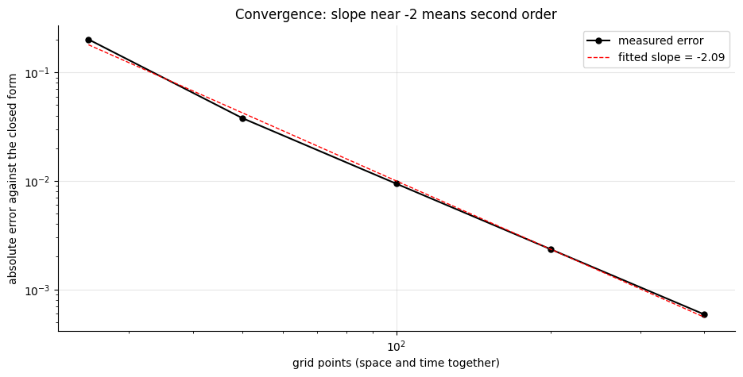
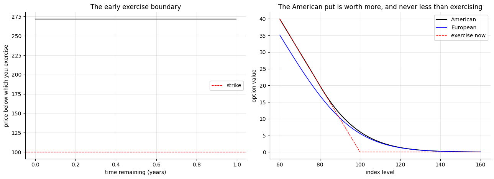
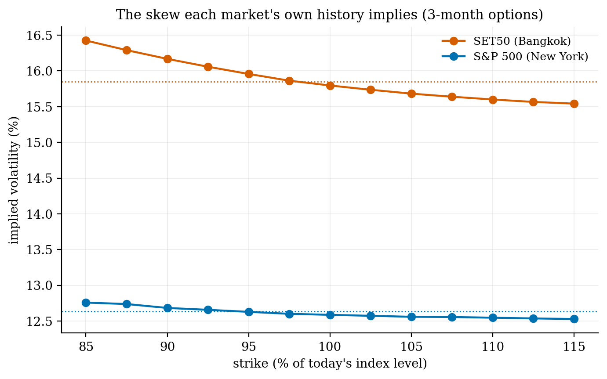
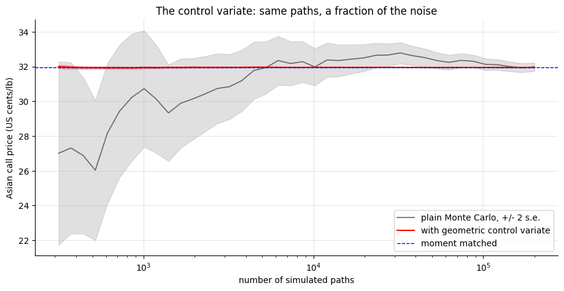
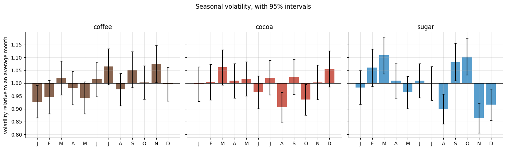
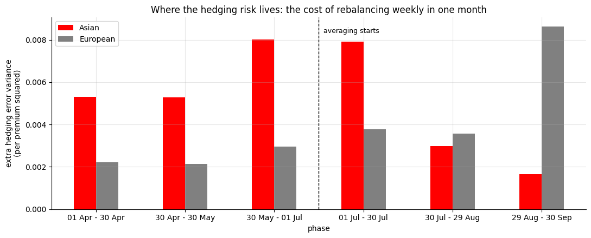
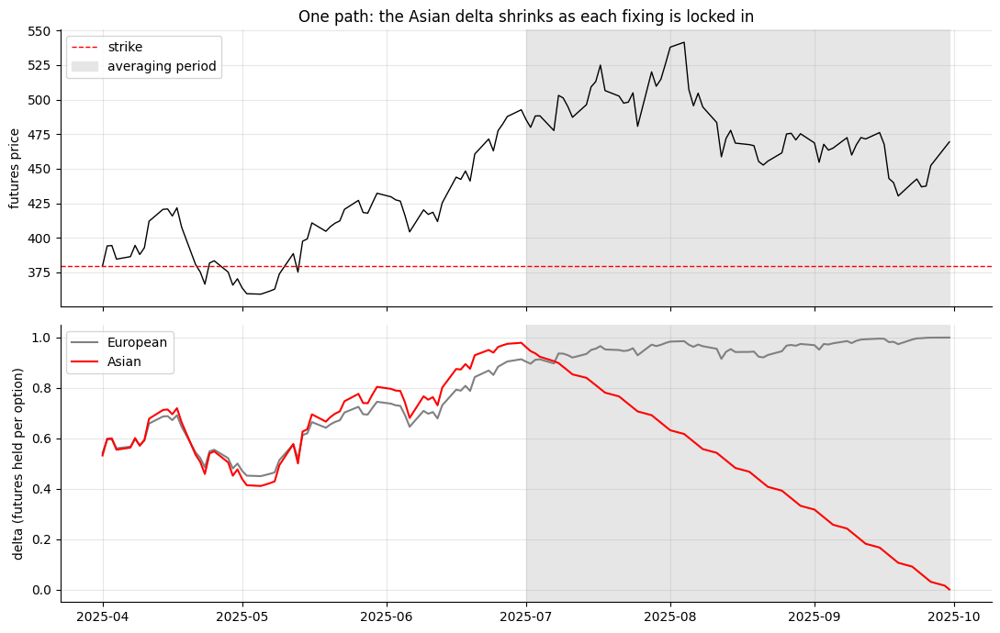

# Pricing options on coffee, cocoa and the Bangkok market

**A PDE solver, Monte Carlo and a delta hedge, from the S&P 500 to soft commodities, with one hedging surprise.**

Three notebooks, one idea: let volatility change through time, then check every price against a second, independent method.

- **01 · European and American (S&P 500).** The forward curve and volatility term structure come straight out of a real option chain. A finite-difference solver converges at order 2.09 (theory says 2), and projected SOR prices American puts to within 0.003 of a binomial tree.
- **02 · Bangkok against New York.** SET50 was more volatile than the S&P 500 over the same year (15.8% against 12.6%) and far more fat-tailed. Its own history implies a steeper downside skew.
- **03 · Asian options on softs.** These pay on the *average* price, the way commodity buyers actually hedge. A control variate cuts Monte Carlo noise by 1,100–7,200×.
  - **The surprise:** the Asian's delta fades as fixings lock in, yet it isn't easier to hedge. Its risk concentrates just before the averaging starts.
  - **Seasonality:** ignoring seasonal volatility changes the price, but not how well the hedge works.

| | |
|:-:|:-:|
|  |  |
|  |  |
|  |  |
|  | |

**Built:** a put–call-parity extraction; σ(t) Black–Scholes; a Crank–Nicolson / SOR solver with Rannacher start-up; a binomial tree; the exact geometric-Asian price; moment matching; a hedging simulator.

`spx_chain.py` · `options_01_solver_european.ipynb` · `options_02_set50.ipynb` · `options_03_asian_softs.ipynb`

*A side project, built for fun. The SET50 work uses index prices; calibrating to TFEX option quotes is the next step. Data isn't redistributed here: put the S&P 500 option chain (4 January 2023), the SET50 history from Investing.com and the Yahoo Finance price files (via yfinance) in `data/` to re-run.*
