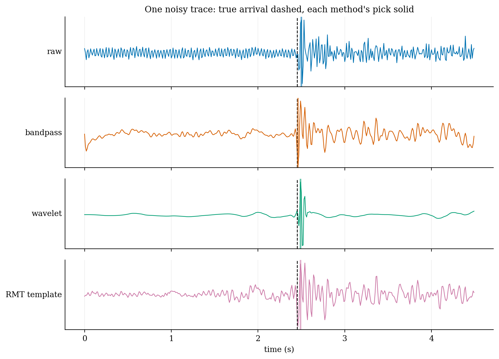
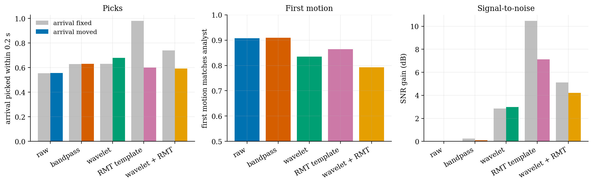
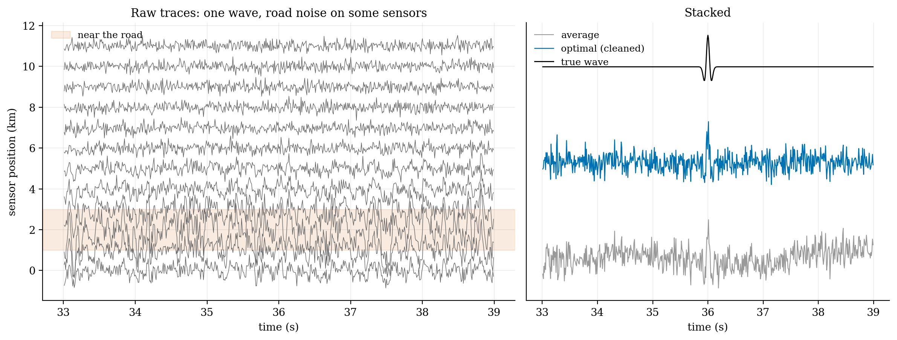
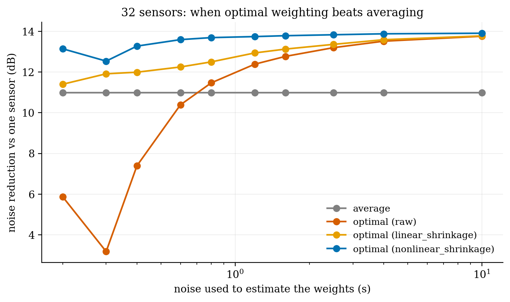
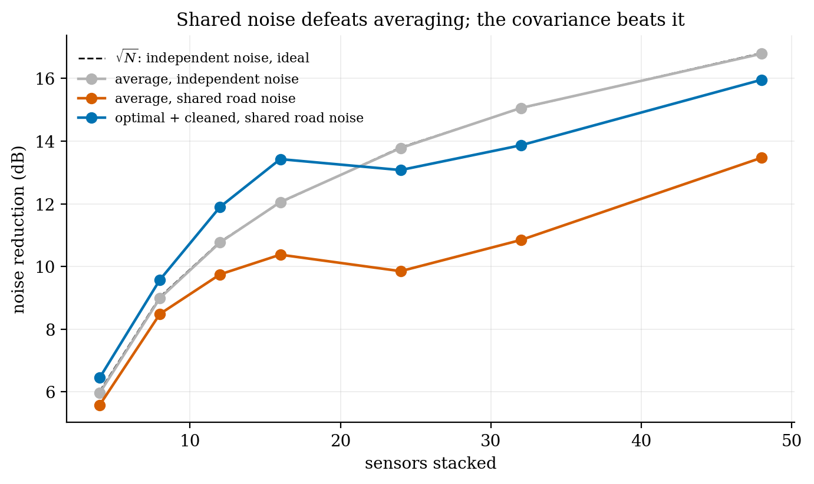

# Hearing small earthquakes under a noisy city

**Geophysics and finance attack the same problem, and one impressive-looking result turns out to be a trick.**

Small earthquakes under Los Angeles are buried in traffic. I scored denoising methods from seismology (filters, wavelets, stacking) and from quantitative finance (random-matrix cleaning, minimum-variance weighting) on 3,000 noisy recordings from the Southern California Seismic Network. They were judged on what a seismologist needs: the arrival time, and which way the ground moved first.

- **A trick exposed.** The random-matrix method picked 98% of arrivals, but only because every recording had its arrival in the same place. Move the arrival and it drops to 60%, barely above doing nothing (56%).
- **A cleaner waveform isn't a better one.** Wavelets add 3 dB of signal-to-noise but flip the first motion on about one trace in fourteen. A plain bandpass filter is the only method that helps without harm.
- **The same equation, twice.** The best way to weight an array of sensors is the minimum-variance portfolio from finance. With a road's noise shared between sensors, it beats averaging, but only once its covariance is cleaned the way you'd clean a stock correlation matrix.

| | |
|:-:|:-:|
|  |  |
|  |  |
|  | |

**Built:** an STA/LTA picker and a first-motion estimator, both calibrated on quiet traces (99% and 97%); a test with randomly moved arrival times; a synthetic array with shared noise; held-out scoring.

`seismic.py` · `seismic_denoiser.ipynb` · Python, NumPy, SciPy, h5py, PyWavelets · uses [`corrlib`](../004-corrlib-correlation-toolbox)

*A side project, built for fun. Labelled waveforms from Ross, Meier & Hauksson (2018), [doi:10.1029/2017JB015251](https://doi.org/10.1029/2017JB015251); Southern California Seismic Network data via the SCEDC, [doi:10.7909/C3WD3xH1](https://doi.org/10.7909/C3WD3xH1). The data isn't included in the repository (6 GB).*
