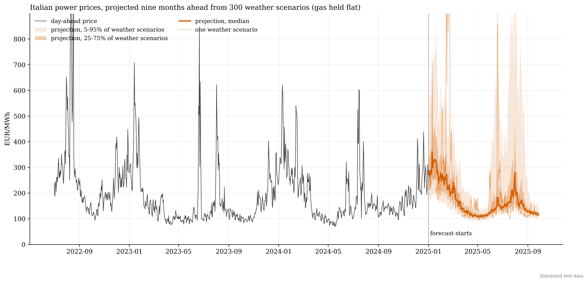
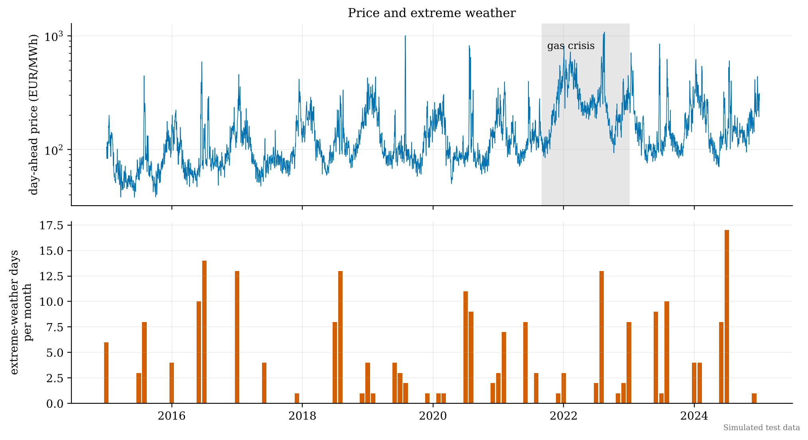
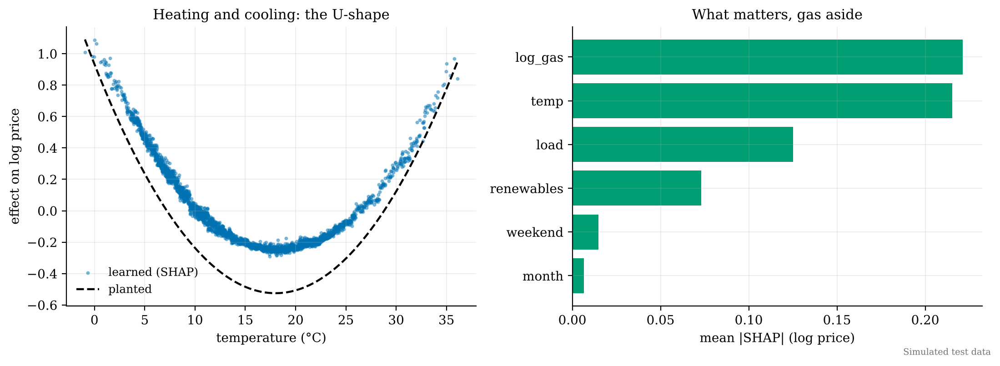
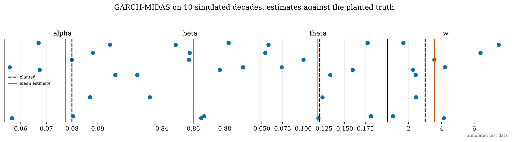
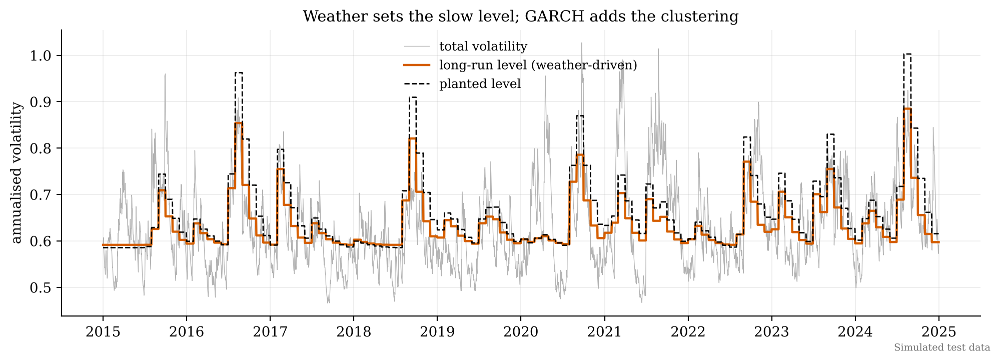
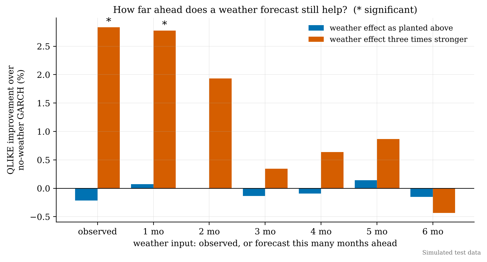

# Can a weather forecast see a power-price storm coming?

**Extreme weather drives Italian electricity-price volatility. The question is how far ahead a forecast still helps.**

A 2026 study found extreme weather to be the main driver of Italian power-price volatility, using a GARCH-MIDAS model on *observed* weather. But observed weather explains volatility after it has happened, and a hedger needs to know before. This project builds the three-stage version: what drives the price, what drives the volatility, and how many months ahead a weather *forecast* still beats assuming average weather.

- **Gas comes first.** A tree model can't extrapolate to crisis-level gas prices it never saw, so it models price *relative to* gas. SHAP then recovers the U-shaped heating and cooling effect of temperature. (On this data a straight line still predicts as well.)
- **The volatility model works on average, not precisely.** Fitted to ten simulated decades, GARCH-MIDAS recovers the weather effect without bias (θ̂ = 0.118 against 0.12 planted), but individual estimates range from 0.05 to 0.18.
- **Detecting the effect is the hard part.** At a modest weather effect, nothing beats a weather-blind model over three test years. With a strong one, forecasts help out to about 1–2 months, then the advantage disappears. On real data, a power calculation comes first.

| | |
|:-:|:-:|
|  |  |
|  |  |
|  | |

**Built:** time-ordered cross-validation; XGBoost + SHAP; GARCH-MIDAS by maximum likelihood with beta-lag weights; GARCH(1,1); QLIKE scoring; Diebold–Mariano tests.

`power.py` · `italian_power.ipynb` · `check_midas.py` · Python, XGBoost, SHAP, SciPy

*A side project, built for fun. It currently runs on simulated data in the shape of the real series (GME prices, ERA5 weather, TTF gas), with relationships planted so each stage can be checked against a known answer. The real series are next.*
