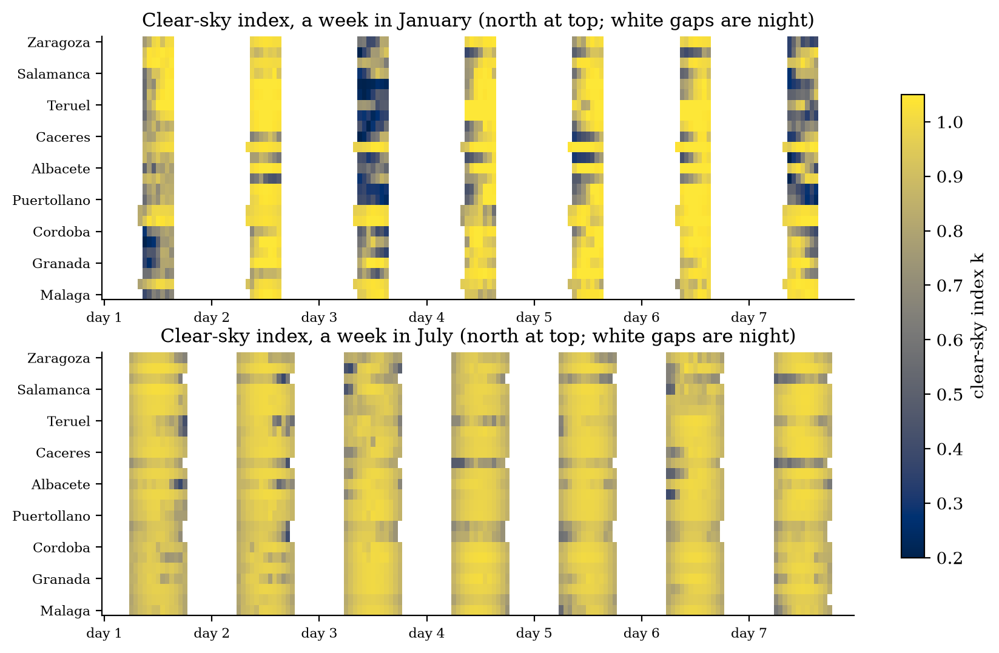
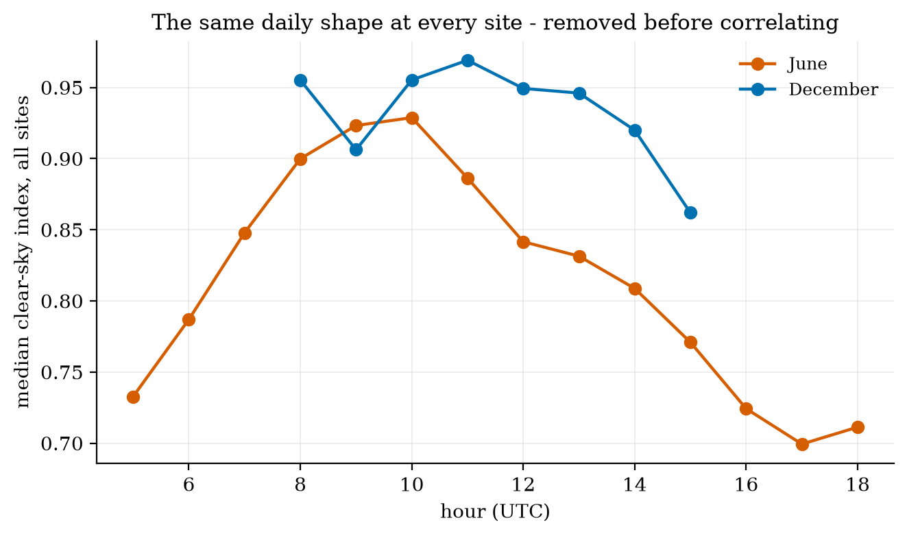
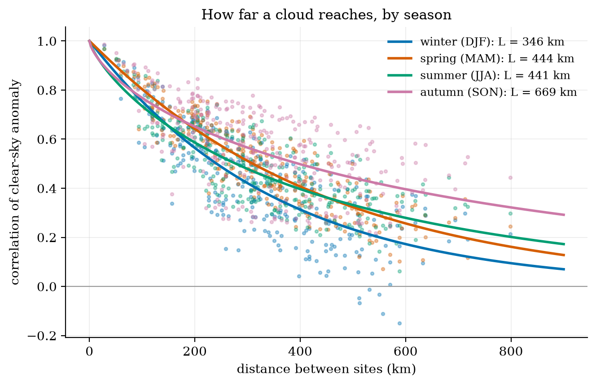
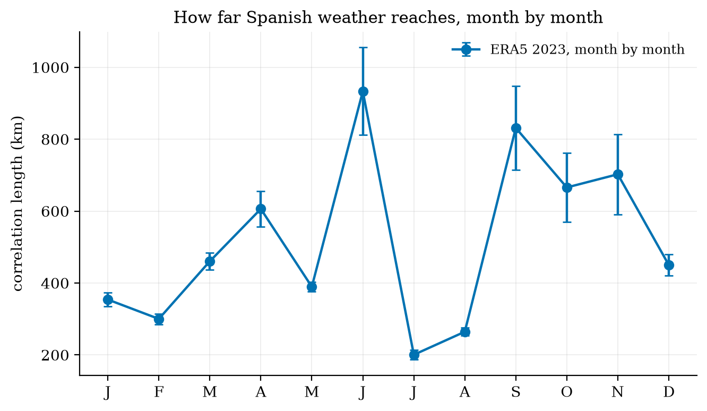
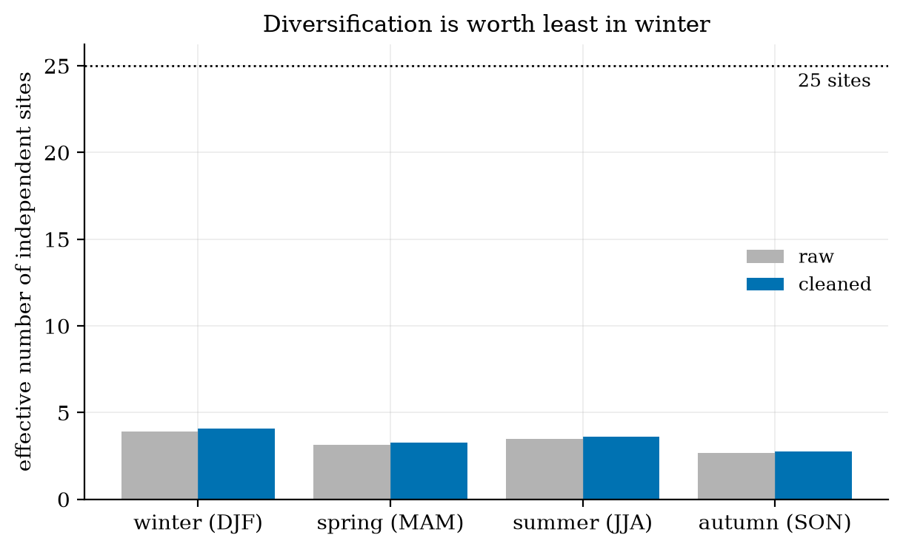
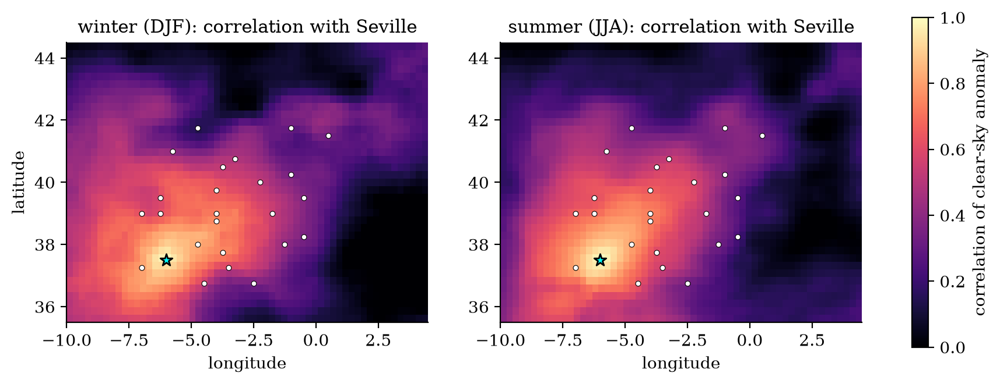

# How far does a cloud reach?

**Spain is building solar farms across a thousand kilometres of country. A year of ERA5 weather shows they behave like three or four.**

A solar fleet spread across a country should smooth itself out: when it is cloudy in Seville, it may be sunny in Zaragoza. How much smoothing you actually get depends on one number, the distance over which the weather stays correlated. This project builds the weather data the way ECMWF's AI forecasting models consume it (an Anemoi dataset), then uses it to measure that distance for 25 Spanish solar regions, season by season.

- **The weather reaches far.** Correlation falls to 1/e over about **350 km in winter, 440 km in spring and summer, and 670 km in autumn**. Twenty-five sites diversify like only **3-4 independent ones**.
- **The expected seasonal story does not appear.** Summer's local convective clouds should shorten correlations. Instead, summer's correlation drops faster over the first 100 km, then lingers at longer distances.
- **The first answer was an artefact.** On real data every site seemed almost perfectly correlated with every other. The cause was a daily shape left over by the clear-sky model, which every site shares; it was invisible on synthetic data. Removing it is what makes the numbers mean anything.

| | |
|:-:|:-:|
|  |  |
|  |  |
|  |  |

**Built:** an ERA5 → Anemoi Zarr pipeline for Iberia (recipe, restartable CDS download as a Slurm array, data-quality checks written as tests, Docker, CI); clear-sky index with correct ERA5 accumulation timing; Gaussian-rank correlation and random-matrix cleaning via [corrlib](../004-corrlib-correlation-toolbox); a fitted stretched-exponential correlation model; effective number of sites.

`iberia_datasets/` · `solar_sites.py` · `solar_01_correlation.ipynb` · `make_cover.py` · Python, anemoi-datasets, ERA5, Zarr, corrlib

**Next:** CERRA at 5.5 km, since ERA5's 31 km grid smooths small clouds and these lengths are upper bounds. Then prices, cannibalisation, and AI (AIFS) against physics forecasts, scored in money.

*A side project, built for fun. Weather: ERA5 (Hersbach et al. 2020, [doi:10.1002/qj.3803](https://doi.org/10.1002/qj.3803)). Contains modified Copernicus Climate Change Service information (2023); neither the European Commission nor ECMWF is responsible for any use of it.*
