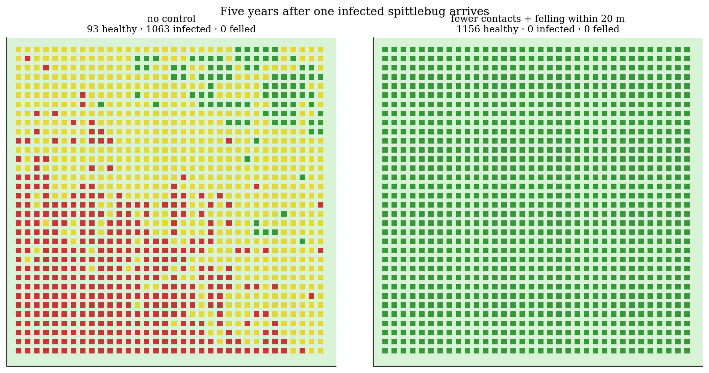
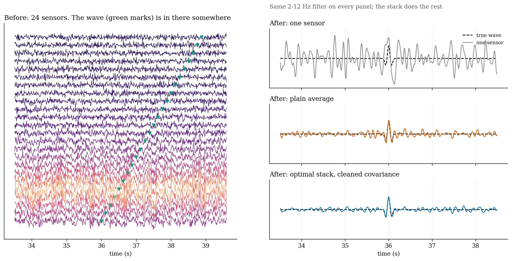
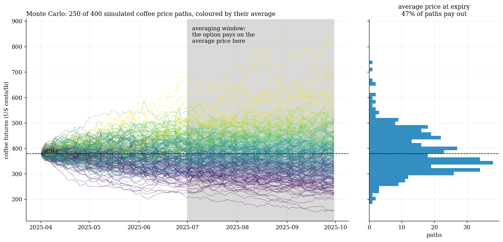
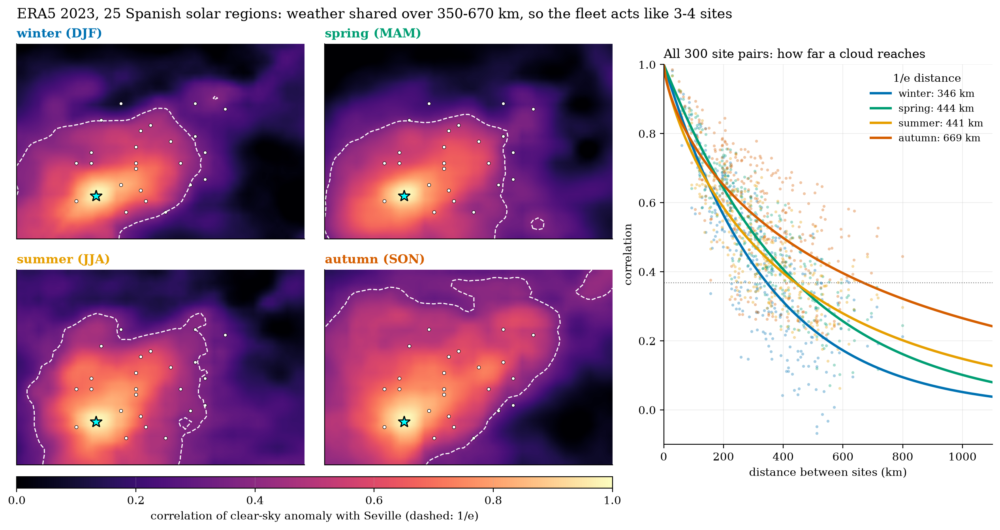

# Kevin Grainger: projects

Seven side projects across earth systems, signal processing and energy markets. Most start from a published model and try to add one honest result. They're built for fun; the write-ups are short, and the graphics do most of the talking.

| | Project | In one line |
|:-:|---|---|
|  | **[001 · Coral reef tipping points](001-coral-reef-tipping-points)** | A reef modelled like a magnet gets stuck after a heatwave, and the classic mean-field models make it look worse than it is. |
|  | **[002 · Olive grove *Xylella*](002-olive-grove-xylella)** | The outbreak sits on a knife-edge, and felling trees doesn't push it off. |
|  | **[003 · corrlib](003-corrlib-correlation-toolbox)** | A tested library for measuring and cleaning correlation matrices. |
|  | **[004 · Seismic denoiser](004-seismic-denoiser)** | Geophysics against finance on small earthquakes under a noisy city, with one impressive result exposed as a trick. |
|  | **[005 · Option pricer](005-option-pricer)** | European, American and Asian options, from the S&P 500 to cocoa and Bangkok, and a hedge that surprises. |
|  | **[006 · Italian power volatility](006-italian-power-volatility)** | How far ahead can a weather forecast see a power-price storm? |
|  | **[007 · Spanish solar portfolio](007-spanish-solar-portfolio)** | How far does a cloud reach, from an ML-ready ERA5 dataset built with ECMWF's Anemoi? |

**Running it.** Each folder has its notebooks with outputs saved; `pip install -r requirements.txt` covers projects 001–006. Project 007's dataset pipeline has its own environment (`007-spanish-solar-portfolio/iberia_datasets/requirements.txt`) and runs in Docker. CI runs the `corrlib` tests and the dataset-pipeline tests on every push.

**Figures** live in each project's `figures/` folder: a `cover` image (made by `make_covers.py`, about 2,600 px wide) plus numbered figures in PNG and PDF, all in one shared style (`figstyle.py`). Anything built on placeholder data is stamped as such.

Large data (SCSN waveforms, ERA5 GRIB, Zarr datasets) isn't committed; each project says where it comes from.
