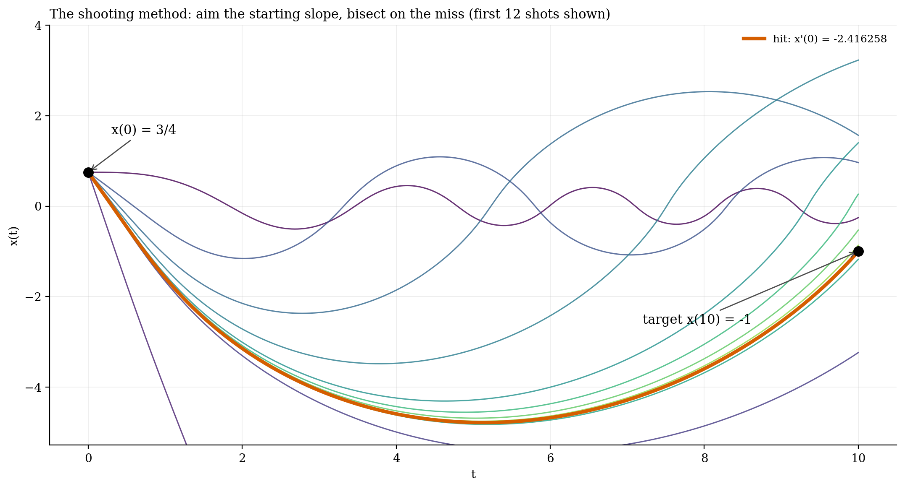
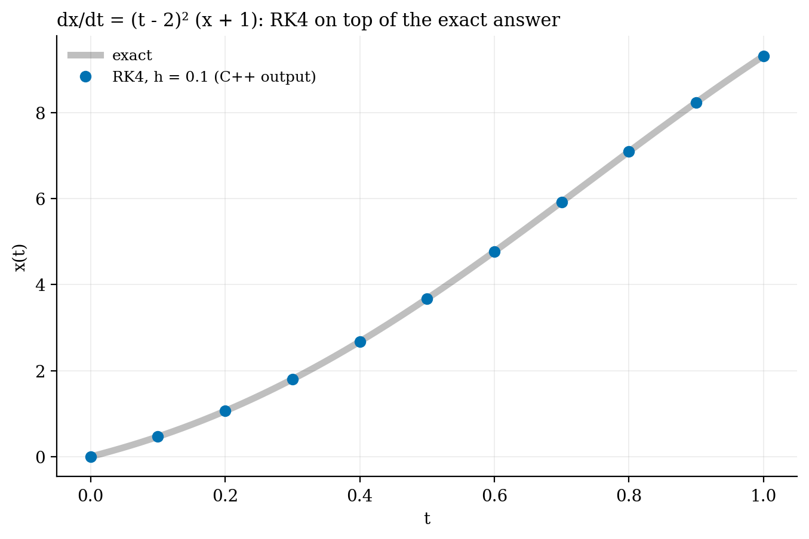
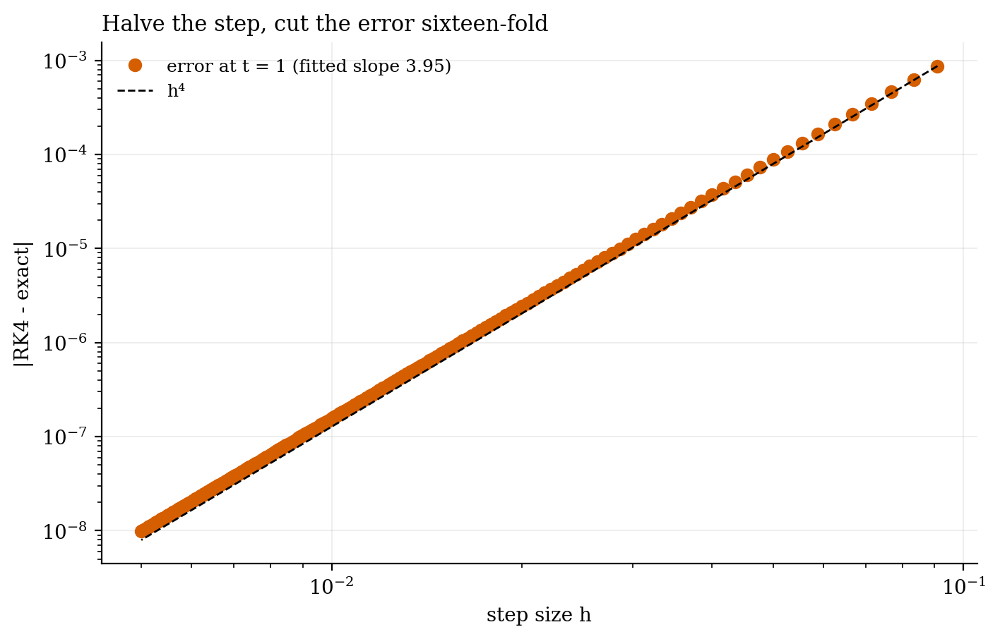
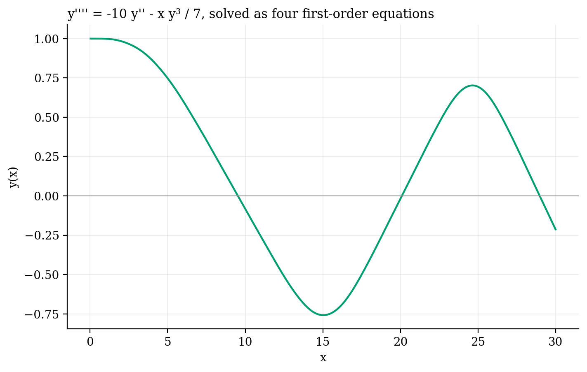

# Higher-order ODEs in C++

**Undergraduate work: a hand-written fourth-order Runge–Kutta integrator, its convergence, and the shooting method for boundary-value problems.**

Most differential equations have no closed-form answer, so you step them forward numerically. Fourth-order Runge–Kutta (RK4) samples the slope four times per step. A higher-order equation becomes a system of first-order ones. For a boundary-value problem, the shooting method guesses the starting slope, integrates, and bisects on how far it misses the target.

- **RK4 matches the exact solution** of dx/dt = (t − 2)²(x + 1) to within about 10⁻³ at a step of 0.1.
- **The error falls as h⁴:** the fitted log-log slope is 3.95. Halving the step cuts the error sixteen-fold.
- **A fourth-order ODE**, y'''' = −10y'' − xy³/7, solved as four coupled first-order equations.
- **Shooting:** x'' = −tx(t + 2)/(2 + t²x²), with x(0) = 3/4 and x(10) = −1, needs a starting slope of x'(0) = −2.416258, found in 25 bisection shots.

| | |
|:-:|:-:|
|  |  |
|  |  |

**Built:** RK4 for scalar and vector systems, step-size analysis and a shooting method with bisection. The figures are re-plotted from the C++ output, and the shooting method is ported to Python (`../make_figures.py`).

`*.cpp` · `Collated Data.txt` · [report](report_odes.pdf) · C++, Python

*Undergraduate coursework, Practical Numerical Simulations, 2024.*
