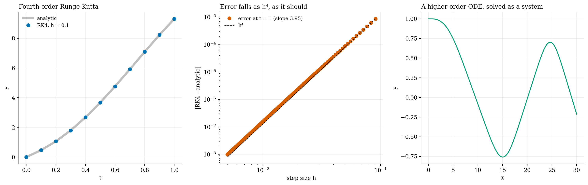

# Higher-order ODEs in C++

**College work: fourth-order Runge–Kutta, step-size analysis and the shooting method.**

Higher-order ODEs, rewritten as first-order systems and solved with a hand-written RK4 integrator. Its error at t = 1 falls with slope 3.95 on a log-log plot, as fourth order should. A shooting method handles the boundary-value problems.

`*.cpp` · `Collated Data.txt` · [report](report_odes.pdf) · C++
