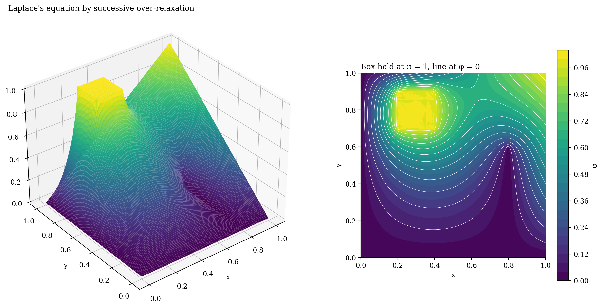
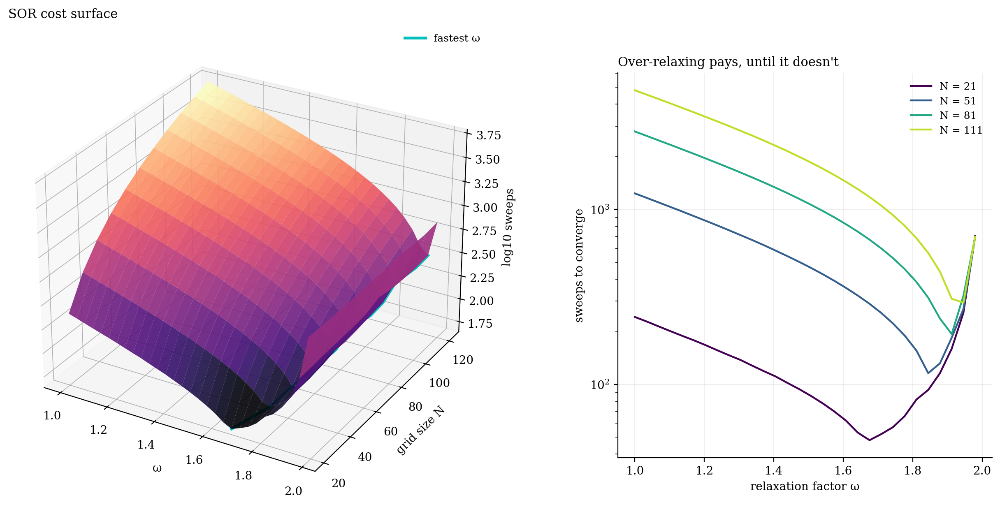
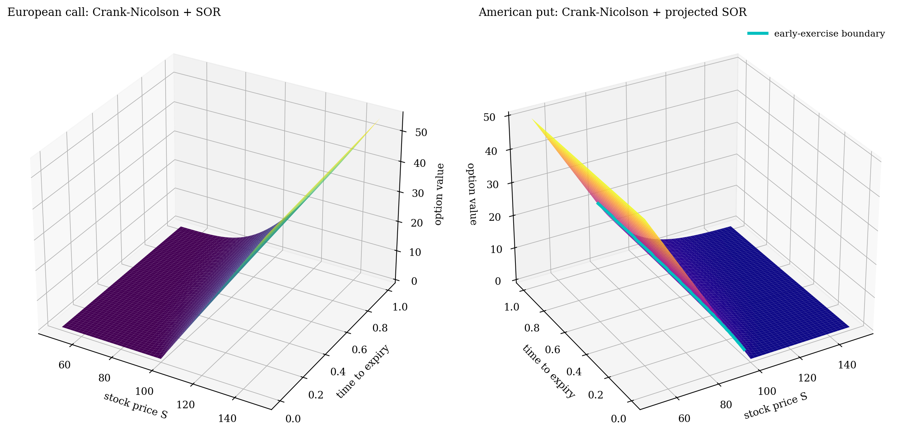
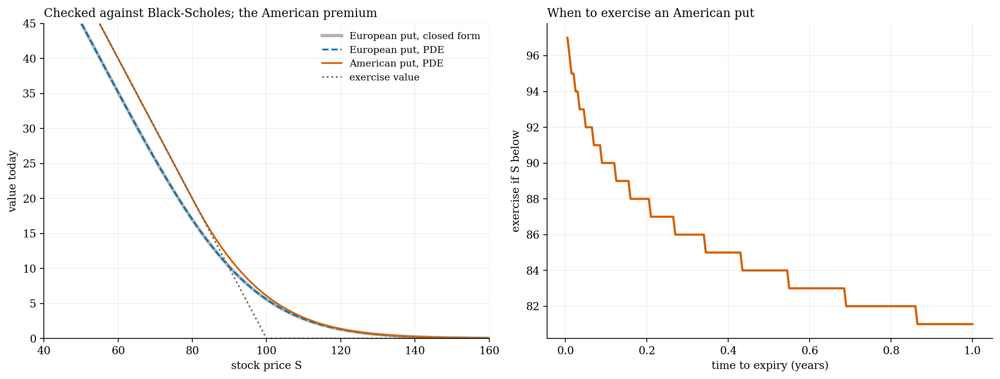
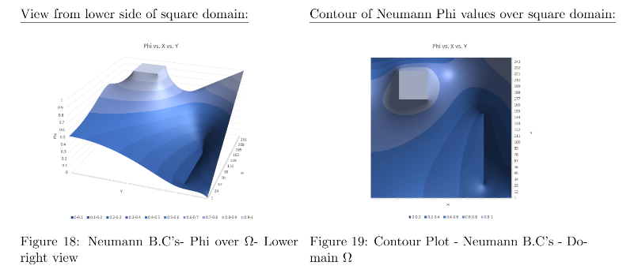

# PDEs by successive over-relaxation

**Undergraduate work in C++, re-plotted with a Numba port, plus a new Black–Scholes solver built the same way.**

Laplace's equation on a square holding a charged box and a grounded wire, solved by successive over-relaxation (SOR) with Dirichlet and Neumann boundaries. How fast SOR converges depends on its relaxation factor ω, so mapping the cost over ω and grid size gives the "parameter surface".

- **The Numba port matches the C++.** It gives the same derivative at (2/5, 1/2), 1.732, and converges in 760 sweeps (1.1 s) at the optimal ω, against 4,047 at ω = 1.8.
- **The best ω climbs towards 2 as the grid refines,** close to the theoretical 2 / (1 + sin(π/(N−1))).
- **New: Black–Scholes the same way.** Crank–Nicolson in time with SOR for each step, and projected SOR for American options, which traces the early-exercise boundary for free. It agrees with the closed form to within 0.003.

| | |
|:-:|:-:|
|  |  |
|  |  |

Also here: a numerical study of the Schrödinger equation ([report](report_schrodinger.pdf)).

`*.cpp` · `pde_numba.py` · `../make_figures.py` · [report](report_pde_solvers.pdf) · C++, Python, Numba
