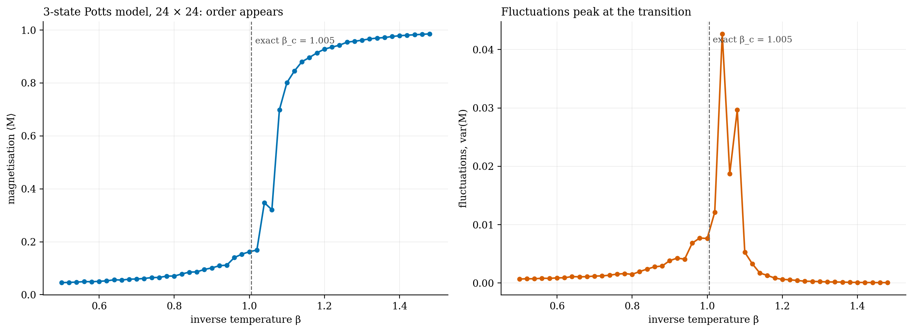

# The Potts model by Monte Carlo

**College work: Metropolis Monte Carlo for the 3-state Potts model on a 24 × 24 lattice.**

Order appears suddenly as the temperature drops. Fluctuations peak at β ≈ 1.04, close to the exact β_c = ln(1 + √3) ≈ 1.005; the small shift is expected on a lattice this size. The same model, scaled up, became the [coral reef project](../../001-coral-reef-tipping-points).

`MC.cpp` · `mc_results.csv` · [report](report_potts.pdf) · C++
