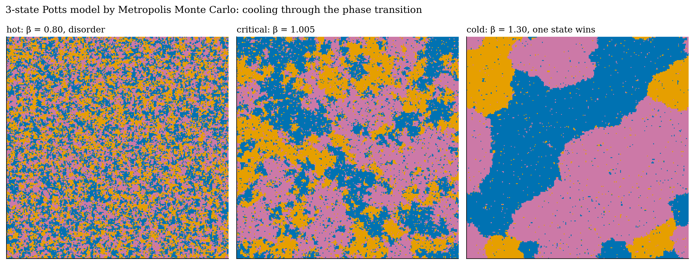
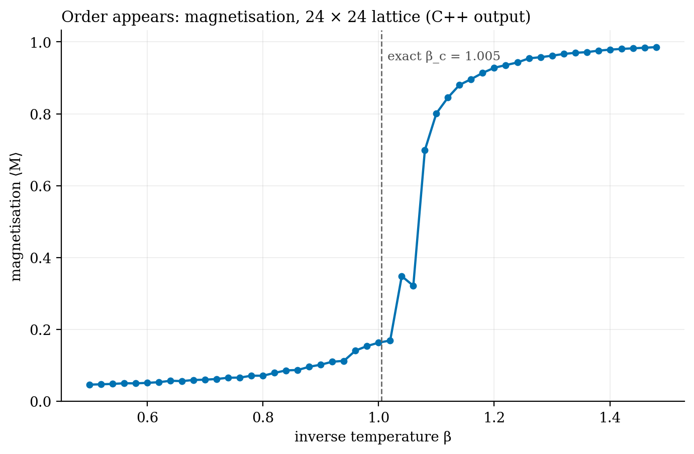
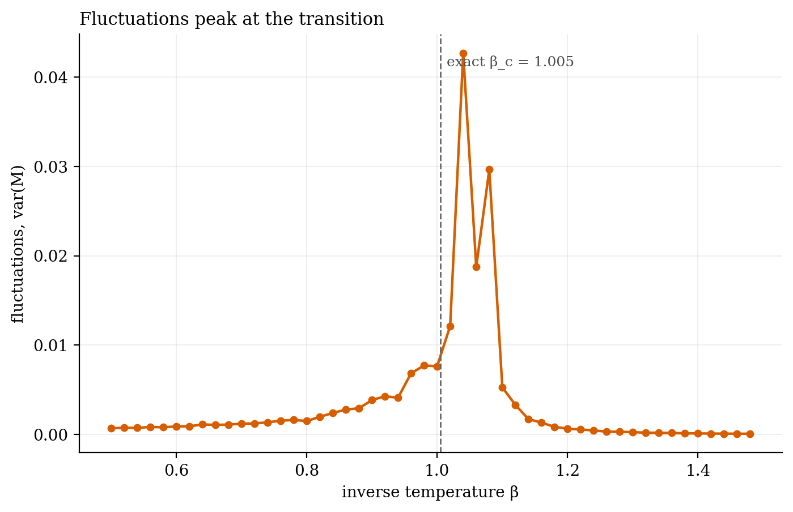
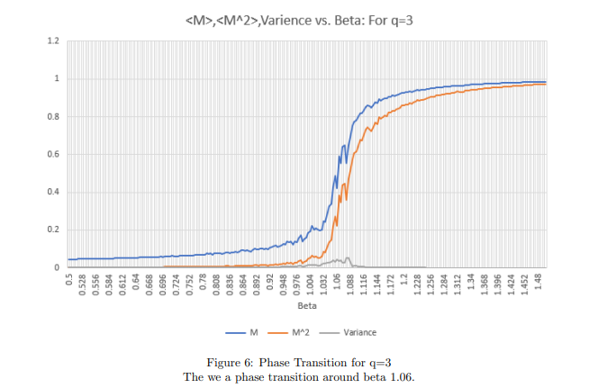

# The Potts model by Monte Carlo

**Undergraduate work: Metropolis Monte Carlo for the 3-state Potts model, cooled through its phase transition.**

Every site on a grid holds one of three states and prefers to match its neighbours. When it's hot, randomness wins and the grid is noise. When it's cold, one state takes over. In between, at a sharp critical temperature, domains of every size appear at once. The Metropolis algorithm samples this by proposing single-site changes and accepting them with Boltzmann probability.

- **Order appears suddenly.** Magnetisation jumps from about 0.1 to 0.9 over a narrow range of inverse temperature β.
- **Fluctuations peak at β ≈ 1.04,** close to the exact β_c = ln(1 + √3) ≈ 1.005. The shift is expected on a 24 × 24 lattice.
- **The snapshots** come from a 256 × 256 Python + Numba port of the C++ code.
- **The same model, scaled up, became the [coral reef project](../../001-coral-reef-tipping-points).**

| | |
|:-:|:-:|
|  |  |
|  | |

`MC.cpp` · `mc_results.csv` · `../make_figures.py` · [report](report_potts.pdf) · C++, Python, Numba

*Undergraduate coursework, 2024. Exact critical point from Baxter (1973).*
